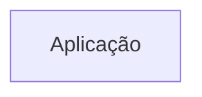
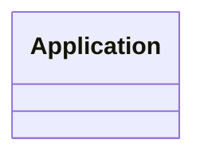

# Arquitetura

<!-- specsfy:documentator:start -->
## Componentes

| Tipo | Quantidade |
| --- | --- |
| Código | 771 |
| Testes | 121 |

## Diagramas

<!-- specsfy:documentator:end -->

## Contexto confirmado

- `apps/web` é a aplicação SvelteKit do produto.
- `apps/desktop` é uma casca Tauri que reutiliza a interface web; o runtime nativo
  mantém um único `app.sqlite` por instalação para o registro operacional de
  workspaces. A pasta escolhida continua preservada como fonte legada/autoral
  durante migração e recovery.
- Pacotes compartilhados restantes: `eslint-config` e `typescript-config`.
- O PWA mantém o registro operacional no IndexedDB versionado `openbible-workspace`,
  com stores de workspaces, ponteiro ativo, migrações legadas, blobs, notas,
  destaques e projeções. O SQLite bíblico WASM continua somente leitura e não é
  importado relacionalmente para o IndexedDB.
- File System Access, OPFS, manifesto e catálogo local são fontes de reencontro,
  migração/recovery ou conteúdo legado; o catálogo é projeção, não autoridade.
- Markdown é a saída portátil das notas e PDF é derivado pelo fluxo de impressão
  offline; o parser preserva a fonte e converte blocos ricos para fallback legível.
- O leitor bíblico existe em `/bible`, a consulta workspace-wide de destaques em
  `/highlights` e o editor Milkdown em `/notes/[id]`. Biblioteca de estudos e
  construtor de sermões continuam reservados para fatias futuras.
