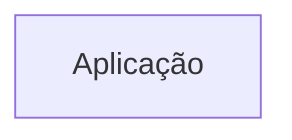
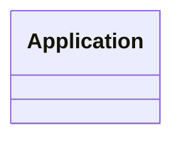

# Arquitetura

<!-- specsfy:documentator:start -->
## Componentes

| Tipo | Quantidade |
| --- | --- |
| Código | 411 |
| Testes | 53 |

## Diagramas

<!-- specsfy:documentator:end -->

## Contexto confirmado

- `apps/web` é a aplicação SvelteKit do produto.
- Pacotes compartilhados restantes: `eslint-config` e `typescript-config`.
- A persistência File Over Apps usa pasta local ou OPFS: Markdown/JSON no
  workspace, SQLite bíblico somente leitura em `bibles/` e `index.sqlite` auxiliar.
- O leitor bíblico existe em `/bible`. Biblioteca de estudos, construtor de
  sermões e notas ainda não escrevem arquivos de domínio.
