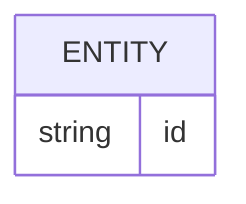

# Banco de dados

<!-- specsfy:documentator:start -->
## Fontes de persistência

| Arquivo |
| --- |
| apps/desktop/src-tauri/src/commands/migration.rs |
| Nenhuma estrutura confirmada além das fontes listadas. |

<!-- specsfy:documentator:end -->

## Modelo confirmado para a próxima etapa

- Sermões, estudos e notas: arquivos Markdown com YAML frontmatter.
- SQLite local: índices, destaques e dados auxiliares.
- Texto bíblico: SQLite importado no padrão OpenLP ou acessado por URL de
  distribuição, incluindo Cloudflare R2.

Nesta fatia, tema, tela inicial e última leitura ficam em
`.openbible/preferences.json`. O `localStorage` só cacheia o primeiro paint.
`.openbible/index.sqlite` é um SQLite válido sem schema de domínio. O modelo
físico de sermões, estudos e notas continua nas specs correspondentes.
