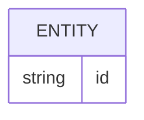

# Banco de dados

<!-- specsfy:documentator:start -->
## Fontes de persistência

| Arquivo |
| --- |
| apps/desktop/src-tauri/migrations/001_create_workspaces.sql |
| apps/desktop/src-tauri/migrations/002_create_workspace_content.sql |
| apps/desktop/src-tauri/migrations/003_create_sync_operational.sql |
| apps/desktop/src-tauri/src/commands/migration.rs |
| apps/sync-api/migrations/0001_sync.sql |
| apps/sync-server/drizzle/0000_skinny_puck.sql |
| apps/web/.svelte-kit/output/server/chunks/workspace-migration.js |
| apps/web/src/lib/features/notes/legacy-migration.test.ts |
| apps/web/src/lib/features/notes/legacy-migration.ts |
| Nenhuma estrutura confirmada além das fontes listadas. |

<!-- specsfy:documentator:end -->

## Modelo operacional de workspaces (SPEC-0016)

- Tauri usa um único `app.sqlite` por instalação em `~/.openbible/app.sqlite`, com `workspaces`,
  `active_workspace_pointer`, `legacy_workspace_migrations`, conteúdo de notas,
  destaques e projeções no schema v2.
- O workspace nativo padrão fica em `~/.openbible/workspace/`; suas Bíblias
  continuam em `bibles/*.sqlite`. Na atualização inicial, o banco e o workspace
  padrão legados são migrados sem alterar workspaces escolhidos manualmente.
- O PWA usa o IndexedDB versionado `openbible-workspace`, com stores
  `workspaces`, `active_workspace_pointer`, `legacy_workspace_migrations`,
  `workspace_blobs`, `workspace_notes`, `workspace_highlights`,
  `workspace_index_state`, `note_verse_ref` e `reader_highlight`.
- Ambos escopam operações por `workspaceId`; o ponteiro ativo carrega geração
  monotônica e a exclusão remove registros em transação do backend.
- Manifesto, catálogo local e raízes Files Over Apps são preservados para
  migração/recovery. O catálogo não é fonte normativa nem entra em sync/backup.

## Modelo confirmado para a próxima etapa

- Sermões, estudos e notas: registro operacional local; Markdown é a forma
  portátil/legada com YAML frontmatter.
- SQLite local: registro operacional do app nativo, índices, destaques e dados
  auxiliares; no PWA o mesmo contrato é realizado pelo IndexedDB.
- Texto bíblico: SQLite importado no padrão OpenLP ou acessado por URL de
  distribuição, incluindo Cloudflare R2.

Nesta fatia, notas e destaques novos usam o backend operacional escopado por
`workspaceId`; Markdown/JSON e `.openbible/index.sqlite` são fontes legadas de
migração/recovery, não o backend ativo. O rebuild nunca altera `bibles/*.sqlite`.
Tema, tela inicial e última leitura ficam em
`.openbible/preferences.json`. O `localStorage` só cacheia o primeiro paint.
`.openbible/index.sqlite` é um SQLite válido sem schema de domínio. O modelo
físico de sermões, estudos e notas continua nas specs correspondentes.
Markdown é o formato portátil/exportável das notas; PDF é uma saída derivada de
impressão offline e não altera a fonte de persistência.
