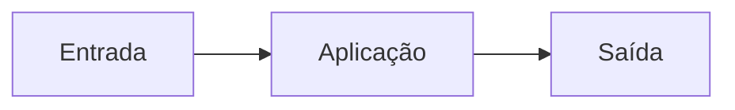
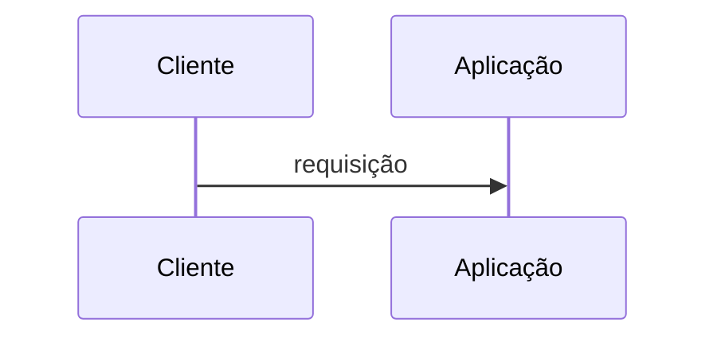
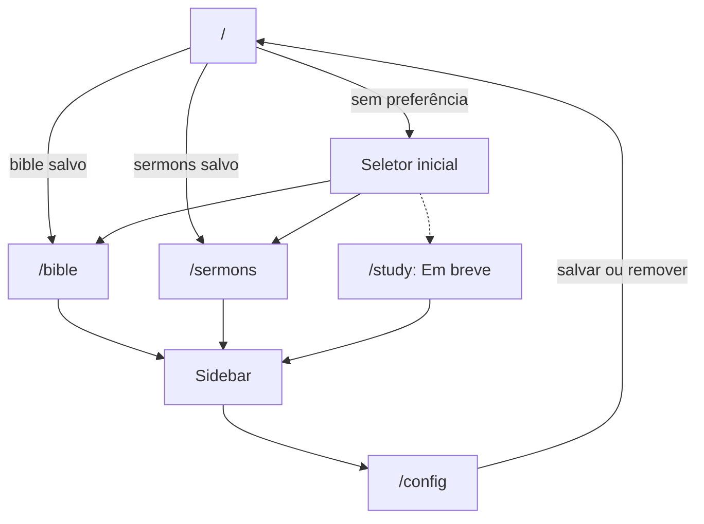
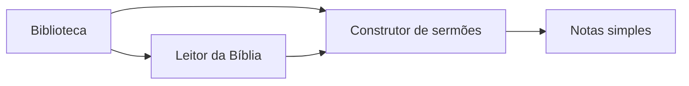

# Fluxos

<!-- specsfy:documentator:start -->
## Fluxo principal

<!-- specsfy:documentator:end -->

## Jornada de produto confirmada

Sem preferência válida, `/` é renderizada sem o shell para manter a escolha como
a única decisão principal. Com Bíblia ou sermão salvo no armazenamento local, a
entrada em `/` usa `goto` para a rota correspondente e o shell mostra o Sidebar.

O fluxo é individual e sem autenticação. O usuário poderá importar um SQLite
bíblico por arrastar e soltar ou informar uma URL de distribuição.
